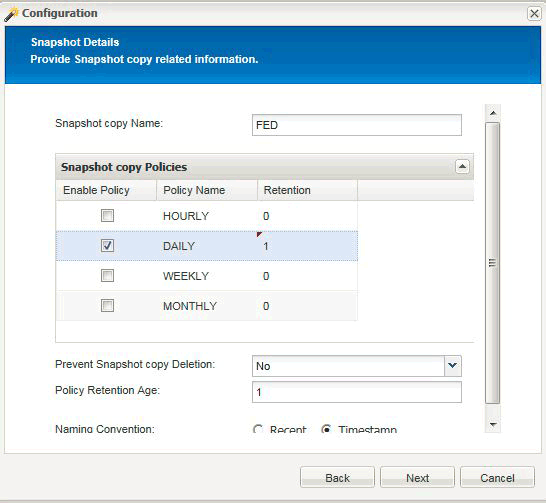

= Configuration de Snap Creator pour des opérations de mise en veille d'applications à plusieurs niveaux lors de l'utilisation de plug-ins d'hyperviseur
:allow-uri-read: 
:icons: font
:imagesdir: ../media/

[role="lead"]
Lorsque vous utilisez l'hyperviseur (également appelés « plug-ins de virtualisation ») (VMware (VMware vCloud Director et VMware vSphere), KVM et Citrix XenServer) et que vous souhaitez effectuer une opération de mise en veille et de sauvegarde d'applications à plusieurs niveaux, vous devez configurer Snap Creator pour ce type de configuration.

Cette configuration vous permet de suspendre une application qui se trouve sur une machine virtuelle, de suspendre la machine virtuelle puis d'effectuer une copie Snapshot.

Au cours de ce processus, vous allez créer une configuration d'hyperviseur et d'application en spécifiant un fichier de configuration parent avec un ou plusieurs fichiers de configuration enfant. Ce fichier de configuration parent contient des informations sur le fichier de configuration type telles que la stratégie de conservation, les détails du SVM et les informations du plug-in de l'hyperviseur. Chaque fichier de configuration enfant contient les informations nécessaires à l'exécution des actions Snap Creator Quesce et unquiesce à l'aide du plug-in d'application spécifique.

. Créer un nouveau profil.
. Créer une nouvelle configuration.
+
.. Sur la page Configuration, entrez un nom pour le fichier de configuration.
+

NOTE: Par défaut, le cryptage par mot de passe est activé pour empêcher l'affichage des mots de passe en clair dans le fichier de configuration.

.. Sur la page Type de plug-in, sélectionnez *Plug-in de virtualisation*.
.. Sur la page du plug-in de virtualisation, sélectionnez le plug-in à configurer.
.. Sur la page des paramètres du plug-in, indiquez les détails de configuration associés à l'option du plug-in sélectionné.
+
Dans l'exemple suivant, VMware vSphere est le plug-in de virtualisation sélectionné. Les écrans de l'assistant qui s'affichent dépendent de votre sélection.

+
... Fournissez les informations appropriées et cliquez sur *Ajouter*.
+
image::../media/scf_config_multilvl_setup_1.gif[configuration scf config multillvl 1]

... Sur la page New vCenter, indiquez l'adresse IP et le nom d'hôte vCenter, puis cliquez sur *Ajouter*.
... Sélectionnez les datastores et machines virtuelles applicables pour la sauvegarde.
+
image::../media/scf_config_multilvl_setup_2.gif[configuration scf config multillvl 2]

... Vérifiez que les informations saisies sont correctes.
... Sur la page Configuration de l'agent, indiquez les détails de l'agent VMware, qui sont les détails du système sur lequel vous avez installé l'agent.
+

NOTE: Le port est le port sur lequel l'agent écoute.

+
Cliquez sur *Tester la connexion de l'agent* pour vous assurer que l'agent est en cours d'exécution.

... Sur la page hyperviseur + App Backup, sélectionnez *Oui* car les sauvegardes cohérentes avec l'hyperviseur et les applications sont nécessaires.
... Sur la page de configuration hyperviseur + application, indiquez le nom de la configuration parent pour la configuration de l'hyperviseur et de l'application.
... Sur la page Type de plug-in, sélectionnez *Plug-in d'application*.
... Sur la page des plug-ins d'application, sélectionnez l'application à utiliser pour la sauvegarde et la restauration.
... Fournissez les détails de l'application sélectionnée.
... Sur la page Configuration de l'agent, fournissez les détails de l'application Snap Creator Agent, qui sont les détails de l'hôte d'application ou de base de données sur lequel vous avez installé l'agent.
+

NOTE: En général, l'hôte est une machine virtuelle sauvegardée pour laquelle une application s'exécute sur celle-ci.

+
Cliquez sur *Tester la connexion de l'agent* pour vous assurer que l'agent est en cours d'exécution.

... Sur la page Résumé, vérifiez les informations et cliquez sur *Terminer*.
... Sur la page hyperviseur + application, vous disposez des options suivantes :
+
**** Pour ajouter des applications supplémentaires à cette configuration, cliquez sur *Ajouter* et répétez les étapes VII à XII dans cet exemple.
**** Pour supprimer des applications de cette configuration, sélectionnez l'élément et cliquez sur *Supprimer*.
**** Pour continuer avec l'assistant de configuration principal, cliquez sur *Suivant*.
+

NOTE: Si plusieurs applications sont répertoriées, vous pouvez réorganiser cette liste en déplaçant une application vers le haut ou vers le bas dans la liste. Les applications sont sauvegardées en série. Si une application doit être mise au repos avant une autre dans la liste, vous devez placer les applications dans l'ordre approprié.

.. Sur la page Paramètres de connexion de stockage, fournissez les informations suivantes :
+
*** Pour l'option *transport*, sélectionnez *HTTPS*.
*** Pour l'option *Controller/Vserver Port*, laissez le paramètre par défaut (443).
*** Pour l'option *Clustered ONTAP*, sélectionnez *Oui*.image:../media/scf_config_multilvl_setup_3.gif[""]

.. Sur la nouvelle page Controller/Vserver, indiquez l'adresse IP du contrôleur, le nom d'utilisateur et le mot de passe.
.. Fournissez les détails de la copie Snapshot.
+

.. Sur la page Suite Détails de l'instantané, ne sélectionnez pas l'option *Groupe de cohérence*.
.. Sur la page protection des données, ne sélectionnez aucune des options *transfert de données*.
.. Vérifiez les informations sur la page Résumé et cliquez sur *Terminer*.

*Informations connexes*

xref:task_creating_profiles.adoc[Création de profils]

xref:task_creating_configuration_files_using_sc_gui.adoc[Création de fichiers de configuration]
