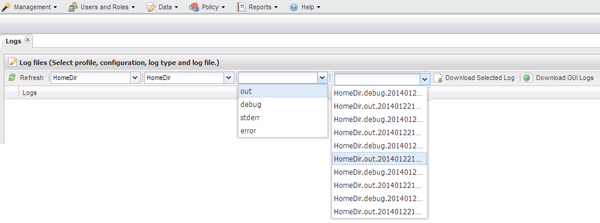

= Journaux de surveillance
:allow-uri-read: 
:icons: font
:imagesdir: ../media/

[role="lead"]
Vous pouvez afficher les journaux de chaque profil et configuration à l'aide de l'interface graphique Snap Creator.

Vous pouvez afficher les journaux OUT, Debug, Error et stderr pour faciliter les opérations de dépannage. Reportez-vous aux références associées pour plus d'informations sur ces journaux de dépannage.

. Dans le menu principal de l'interface graphique Snap Creator, sélectionnez *Rapports* > *journaux* :
+
image::../media/reports_logs.gif[journaux de rapports]

. Sélectionnez les journaux par profil, fichier de configuration, type de journal ou journal spécifique, selon les besoins :
+

+
Le journal sélectionné peut également être téléchargé en cliquant sur *Télécharger le journal sélectionné*. Le fichier journal téléchargé est stocké dans le répertoire (ou dossier) spécifié par le navigateur pour les téléchargements.

+

NOTE: Les journaux out, debug, stderr et agent sont conservés comme défini par LA valeur LOG_NUM dans le fichier de configuration, mais le journal des erreurs est toujours ajouté.

*Informations connexes*

xref:reference_logs.adoc[Types de messages d'erreur et journaux de dépannage]
