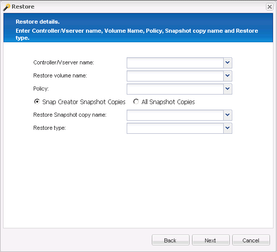

= Exécution de la restauration de volume
:allow-uri-read: 
:icons: font
:imagesdir: ../media/

[role="lead"]
Vous pouvez effectuer une restauration de volume à l'aide de l'interface graphique Snap Creator.

. Dans le menu principal de l'interface graphique Snap Creator, sélectionnez *Management* > *configurations*.
. Dans l'onglet *configurations*, dans le volet *profils et Configuration*, sélectionnez le fichier de configuration.
. Sélectionnez *action* > *Restaurer*.
+
L'assistant de restauration s'affiche dans le volet droit.

. Complétez les pages de l'assistant de restauration pour effectuer la restauration.
+
.. Dans la page *Restore details*, sélectionnez le nom du contrôleur/SVM, Restore volume name, Policy et Restore snapshot copy name, puis sélectionnez *Volume Restore* dans la liste déroulante *Restore type*.
+

.. Vérifiez le résumé, puis cliquez sur *Terminer*.

+
Un message d'avertissement s'affiche pour vous demander si d'autres éléments doivent être restaurés.

. Cliquez sur *non*, puis sur *OK* sur la page de confirmation de restauration.
. Dans le volet *Console*, vérifiez que la restauration a été effectuée avec succès en visualisant les messages.

