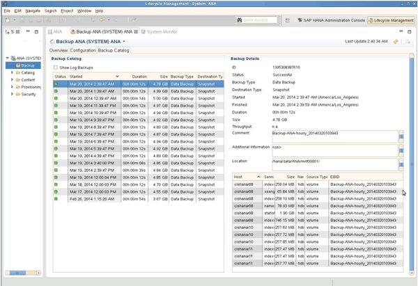

= Examen des sauvegardes disponibles dans SAP HANA Studio
:allow-uri-read: 
:icons: font
:imagesdir: ../media/

[role="lead"]
La liste des sauvegardes Snapshot de stockage est disponible dans SAP HANA Studio.

La sauvegarde mise en évidence dans la figure suivante montre une copie Snapshot nommée « Backup-ANA_hourly_20140320103943 ». Cette sauvegarde inclut des copies Snapshot pour les trois volumes de données du système SAP HANA. La sauvegarde est également disponible au niveau du système de stockage secondaire.

image::../media/sap_hana_backup_list_scfw_gui.gif[Cette image est expliquée par le texte qui l'entoure.]

Le nom de la copie Snapshot est utilisé par Snap Creator comme ID de sauvegarde lorsque Snap Creator enregistre la copie Snapshot de stockage dans le catalogue de sauvegardes SAP HANA. Dans SAP HANA Studio, la sauvegarde Snapshot de stockage est visible dans le catalogue des sauvegardes. L'ID de sauvegarde externe (EBID) a la même valeur que le nom de la copie Snapshot, comme indiqué dans la figure suivante.

À chaque exécution de sauvegarde, Snap Creator supprime les sauvegardes Snapshot sur le stockage principal et sur le stockage secondaire, en fonction des règles de conservation définies pour les différents calendriers (horaire, quotidien, etc.).

Snap Creator supprime également les sauvegardes dans le catalogue de sauvegardes SAP HANA si la sauvegarde n'existe pas sur le stockage primaire ou secondaire. Le catalogue des sauvegardes SAP HANA affiche toujours la liste complète des sauvegardes disponibles sur le stockage primaire et/ou secondaire.
