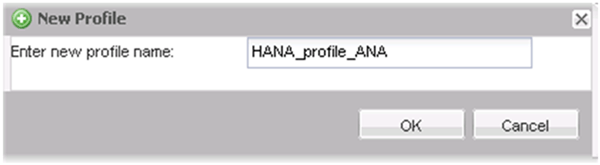
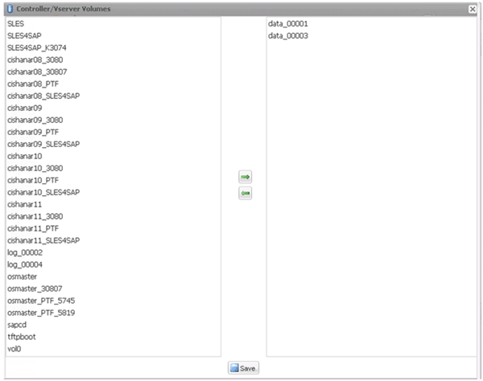
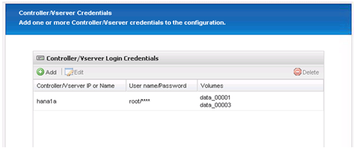
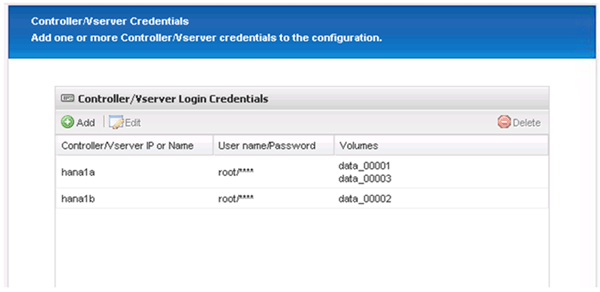
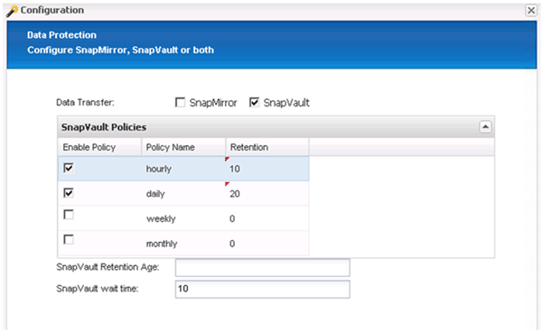

= Configuration de la sauvegarde des bases de données Snap Creator Framework et SAP HANA
:allow-uri-read: 
:icons: font
:imagesdir: ../media/

[role="lead"]
Vous devez configurer Snap Creator Framework et la sauvegarde de la base de données SAP HANA.

. Connectez-vous à l'interface utilisateur graphique Snap Creator : https://host:8443/ui/[].
. Connectez-vous à l'aide du nom d'utilisateur et du mot de passe qui ont été configurés lors de l'installation. Cliquez sur *connexion*.
+
image::../media/snap_creator_gui.gif[Affiche la connexion à l'interface utilisateur graphique Snap Creator]

. Entrez un nom de profil et cliquez sur *OK*.
+

+
Par exemple, « ANA » est le SID de la base de données.

. Entrez le nom de la configuration et cliquez sur *Suivant*.
+
image::../media/sap_hana_gui_for_configuration_name.gif[Affiche le nom de configuration saisi dans le champ]

. Sélectionnez *application Plug-in* comme type de plug-in, puis cliquez sur *Suivant*.
+
image::../media/sap_hana_config_plugin_type.gif[affiche le plug-in d'application sélectionné]

. Sélectionnez *SAP HANA* comme plug-in d'application, puis cliquez sur *Suivant*.
+
image::../media/sap_hana_select_application_plug_in.gif[sap hana select application plug in]

. Saisissez les détails de configuration suivants :
+
.. Sélectionnez *Oui* dans le menu déroulant pour utiliser la configuration avec une base de données multitenant. Pour une base de données de conteneur unique, sélectionnez *non*.
.. Si le conteneur de base de données multitenant est défini sur *non*, vous devez fournir le SID de base de données.
.. Si le conteneur de base de données multitenant est défini sur *Oui*, vous devez ajouter les clés hdbuserstore pour chaque nœud SAP HANA.
.. Ajoutez le nom de la base de données des locataires.
.. Ajoutez les nœuds HANA sur lesquels l'instruction hdbsql doit être exécutée.
.. Entrez le numéro d'instance du nœud HANA.
.. Indiquez le chemin d'accès au fichier exécutable hdbsql.
.. Ajoutez l'utilisateur OSDB.
.. Sélectionnez *Oui* dans la liste déroulante pour activer le nettoyage DU JOURNAL.
+
REMARQUE :

+
*** Paramètre `HANA_SID` est disponible uniquement si la valeur du paramètre `HANA_MULTITENANT_DATABASE` est défini sur `N`
*** Pour les conteneurs de base de données mutualisés (MDC) avec un type de ressource « locataire unique », les copies Snapshot SAP HANA fonctionnent avec l'authentification basée sur la clé UserStore. Si le `HANA_MULTITENANT_DATABASE` le paramètre est défini sur `Y`, puis le `HANA_USERSTORE_KEYS` le paramètre doit être défini sur la valeur appropriée.
*** À l'instar des conteneurs de bases de données non mutualisés, la fonction de sauvegarde et de vérification de l'intégrité basée sur des fichiers est prise en charge

.. Cliquez sur *Suivant*.

+

. Activez l'opération de sauvegarde basée sur les fichiers :
+
.. Définissez l'emplacement de sauvegarde des fichiers.
.. Spécifiez le préfixe de sauvegarde des fichiers.
.. Cochez la case *Activer la sauvegarde de fichiers*.
.. Cliquez sur *Suivant*.
+
image::../media/enable_file_based_backup.gif[activer la sauvegarde basée sur des fichiers]

. Activer l'opération de vérification de l'intégrité de la base de données :
+
.. Définissez l'emplacement temporaire de sauvegarde de fichiers.
.. Cochez la case *Activer la vérification de l'intégrité de la base de données*.
.. Cliquez sur *Suivant*.

+
image::../media/integrity_checks.gif[Vérification de l'intégrité de la base de données]

. Entrez les détails du paramètre de configuration de l'agent, puis cliquez sur *Suivant*.
+
image::../media/sap_hana_agent_configuration_parameter.gif[Cette image est expliquée par le texte qui l'entoure.]

. Entrez les paramètres de connexion de stockage et cliquez sur *Suivant*.
+
image::../media/sap_hana_storage_connect_gui.gif[Cette image est expliquée par le texte qui l'entoure.]

. Entrez les informations d'identification de connexion au stockage, puis cliquez sur *Suivant*.
+
image::../media/sap_hana_storage_login_credentials_gui.gif[Cette image est expliquée par le texte qui l'entoure.]

. Sélectionnez les volumes de données stockés sur ce contrôleur de stockage, puis cliquez sur *Enregistrer*.
+

. Cliquez sur *Ajouter* pour ajouter un autre contrôleur de stockage.
+

. Entrez les informations d'identification de connexion au stockage, puis cliquez sur *Suivant*.
+
image::../media/sap_hana_storage_login_credentials2.gif[Cette image est expliquée par le texte qui l'entoure.]

. Sélectionnez les volumes de données stockés sur le deuxième contrôleur de stockage que vous avez créé, puis cliquez sur *Enregistrer*.
+
image::../media/sap_hana_controller_volumes_selection.gif[Cette image est expliquée par le texte qui l'entoure.]

. La fenêtre Controller/Vserver Credentials affiche les contrôleurs et volumes de stockage que vous avez ajoutés. Cliquez sur *Suivant*.
+

. Entrez la configuration de la règle Snapshot et de la conservation.
+
La conservation de trois copies Snapshot par jour et de huit heures est un exemple et peut être configurée différemment en fonction des besoins du client.

+

NOTE: Sélectionnez *Timestamp* comme convention de dénomination. L'utilisation de la convention de nommage *Recent* n'est pas prise en charge avec le plug-in SAP HANA, car l'horodatage de la copie Snapshot est également utilisé pour les entrées du catalogue de sauvegardes SAP HANA.

+
image::../media/sap_hana_snapshot_details_gui.gif[Cette image est expliquée par le texte qui l'entoure.]

. Aucune modification requise. Cliquez sur *Suivant*.
+
image::../media/sap_hana_snapshot_details_continued_gui.gif[Cette image est expliquée par le texte qui l'entoure.]

. Sélectionnez *SnapVault*, puis configurez les stratégies de rétention SnapVault et le temps d'attente SnapVault.
+

. Cliquez sur *Ajouter*.
+
image::../media/sap_hana_data_protection_volumes.gif[Cette image est expliquée par le texte qui l'entoure.]

. Sélectionnez un contrôleur de stockage source dans la liste et cliquez sur *Suivant*.
+
image::../media/sap_hana_dp_volumes_gui_select_storage_controller.gif[Cette image est expliquée par le texte qui l'entoure.]

. Sélectionnez tous les volumes stockés sur le contrôleur de stockage source, puis cliquez sur *Enregistrer*.
+
image::../media/sap_hana_volume_selection_gui.gif[Cette image est expliquée par le texte qui l'entoure.]

. Cliquez sur *Ajouter*, puis sélectionnez le deuxième contrôleur de stockage source dans la liste, puis cliquez sur *Suivant*.
+
image::../media/sap_hana_configuration_data_protection_volumes_select_controller.gif[Cette image est expliquée par le texte qui l'entoure.]

. Sélectionnez tous les volumes stockés sur le second contrôleur de stockage source, puis cliquez sur *Enregistrer*.
+
image::../media/sap_hana_data_protection_volume_selection.gif[Cette image est expliquée par le texte qui l'entoure.]

. La fenêtre Data protection volumes (volumes de protection des données) affiche tous les volumes devant être protégés dans la configuration que vous avez créée. Cliquez sur *Suivant*.
+
image::../media/sap_hana_data_protection_volumes_gui.gif[Cette image est expliquée par le texte qui l'entoure.]

. Entrez les informations d'identification des contrôleurs de stockage cibles, puis cliquez sur *Suivant*. Dans cet exemple, les identifiants utilisateur « root » sont utilisés pour accéder au système de stockage. En général, un utilisateur de sauvegarde dédié est configuré sur le système de stockage, puis utilisé avec Snap Creator.
+
image::../media/sap_hana_data_protection_relationships_gui.gif[Cette image est expliquée par le texte qui l'entoure.]

. Cliquez sur *Suivant*.
+
image::../media/sap_hana_dfm_oncommand_settings_gui.gif[Interface graphique DFM/OnCommand Setting. Cette image est expliquée par le texte qui l'entoure.]

. Cliquez sur *Finish* pour terminer la configuration.
+
image::../media/sap_hana_data_protection_configuration_summary.gif[Cette image est expliquée par le texte qui l'entoure.]

. Cliquez sur l'onglet *Paramètres SnapVault*.
. Sélectionnez *Oui* dans la liste déroulante de l'option *SnapVault Restore Wait* et cliquez sur *Save*.
+
image::../media/sap_hana_snapvault_settings_gui.gif[Cette image est expliquée par le texte qui l'entoure.]

+
Il est recommandé d'utiliser un réseau dédié pour le trafic de réplication. Si vous décidez de le faire, vous devez inclure cette interface dans le fichier de configuration Snap Creator en tant qu'interface secondaire.

+
Vous pouvez également configurer des interfaces de gestion dédiées de sorte que Snap Creator puisse accéder au système de stockage source ou cible en utilisant une interface réseau qui n'est pas liée au nom d'hôte du contrôleur de stockage.

+
[listing]
----
mgmtsrv01:/opt/NetApp/Snap_Creator_Framework_411/scServer4.1.1c/engine/configs/HANA_profile_ANA
# vi ANA_database_backup.conf

#####################################################################
########################
#     Connection Options                                            #
#####################################################################
########################
PORT=443
SECONDARY_INTERFACES=hana1a:hana1a-rep/hana2b;hana1b:hana1b-rep/hana2b
MANAGEMENT_INTERFACES=hana2b:hana2b-mgmt
----

