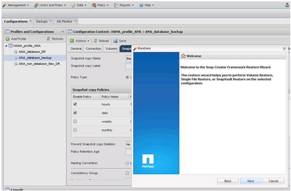
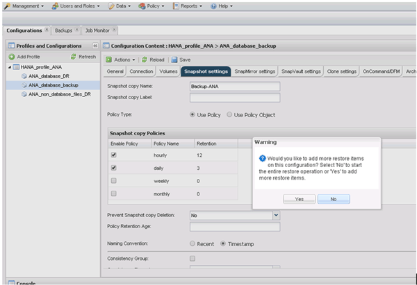
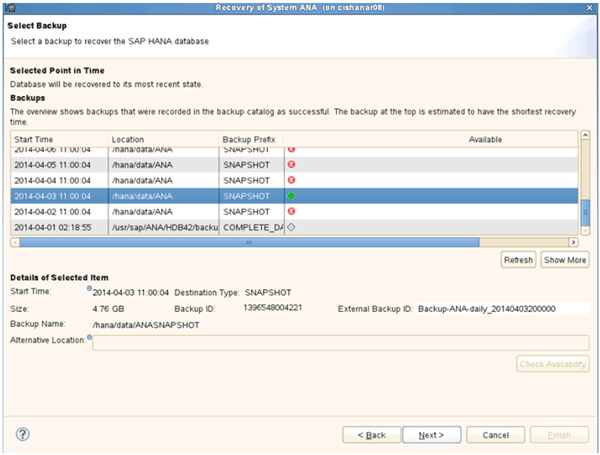

= Restauration et récupération des bases de données à partir du système de stockage secondaire
:allow-uri-read: 
:icons: font
:imagesdir: ../media/

[role="lead"]
Vous pouvez restaurer et récupérer la base de données à partir du stockage secondaire.

. Dans SAP HANA Studio, sélectionnez *recover* pour le système SAP HANA.
+
image::../media/sap_hana_recovery_secondary_storage_gui.gif[Cette image est expliquée par le texte qui l'entoure.]

+
Le système SAP HANA va être arrêté.

. Sélectionnez le type de récupération et cliquez sur *Suivant*.
+
image::../media/sap_hana_secondary_specify_recovery_type.gif[Cette image est expliquée par le texte qui l'entoure.]

. Indiquez les emplacements de sauvegarde des journaux et cliquez sur *Suivant*.
+
image::../media/sap_hana_secondary_log_backup_locations.gif[Cette image est expliquée par le texte qui l'entoure.]

+
La liste des sauvegardes disponibles s'affiche en fonction du contenu du catalogue de sauvegardes.

. Sélectionnez la sauvegarde requise et notez l'ID de sauvegarde externe.
+
image::../media/sap_hana_recover_secondary_select_backup.gif[Cette image est expliquée par le texte qui l'entoure.]

. Accédez à l'interface graphique Snap Creator.
. Sélectionnez le système SAP HANA, puis cliquez sur *actions* > *Restaurer*.
+
image::../media/sap_hana_secondary_select_backup_restore.gif[Cette image est expliquée par le texte qui l'entoure.]

+
L'écran Bienvenue s'affiche.

+

. Cliquez sur *Suivant*.
. Sélectionnez *secondaire* et cliquez sur *Suivant*.
+
image::../media/sap_hana_secondary_restore.gif[Cette image est expliquée par le texte qui l'entoure.]

. Entrez les informations requises. Le nom du snapshot est en corrélation avec l'ID de sauvegarde sélectionné dans SAP HANA Studio.
+
image::../media/sap_hana_select_backup_restore04_secondary_scf_gui.gif[Cette image est expliquée par le texte qui l'entoure.]

. Sélectionnez *Terminer*.
+
image::../media/sap_hana_secondary_restore_summary.gif[Cette image est expliquée par le texte qui l'entoure.]

. Cliquez sur *Oui* pour ajouter d'autres éléments à restaurer.
+

. Fournissez les informations requises pour tous les volumes à restaurer. Dans le fichier setup Data_00001, Data_00002 et Data_00003 doivent être sélectionnés pour le processus de restauration.
+
image::../media/sap_hana_secondary_snapvault_restore.gif[Cette image est expliquée par le texte qui l'entoure.]

. Lorsque tous les volumes sont sélectionnés, sélectionnez *OK* pour lancer le processus de restauration.
+
Attendez que le processus de restauration soit terminé.

. Sur chaque nœud de base de données, remontez tous les volumes de données pour nettoyer « les pointeurs NFS du système ».
+
Dans l'exemple, les trois volumes doivent être remontés sur chaque nœud de base de données.

+
[listing]
----
mount -o remount /hana/data/ANA/mnt00001
mount -o remount /hana/data/ANA/mnt00002
mount -o remount /hana/data/ANA/mnt00003
----
. Accédez à SAP HANA Studio et cliquez sur *Refresh* pour mettre à jour la liste de sauvegarde.
+

. La sauvegarde restaurée avec Snap Creator est indiquée par une icône verte dans la liste des sauvegardes. Sélectionnez la sauvegarde et cliquez sur *Suivant*.
. Sélectionnez d'autres paramètres comme requis et cliquez sur *Suivant*.
+
image::../media/sap_hana_secondary_other_settings.gif[Cette image est expliquée par le texte qui l'entoure.]

. Cliquez sur *Terminer*.
+
image::../media/sap_hana_secondary_review_recovery_settings.gif[Cette image est expliquée par le texte qui l'entoure.]

+
Le processus de récupération commence.

+
image::../media/sap_hana_secondary_recovery_progress_information.gif[Cette image est expliquée par le texte qui l'entoure.]

. Une fois le processus de restauration terminé, reprenez les relations SnapVault, le cas échéant.
+
image::../media/sap_hana_secondary_recovery_execution_summary.gif[Cette image est expliquée par le texte qui l'entoure.]

