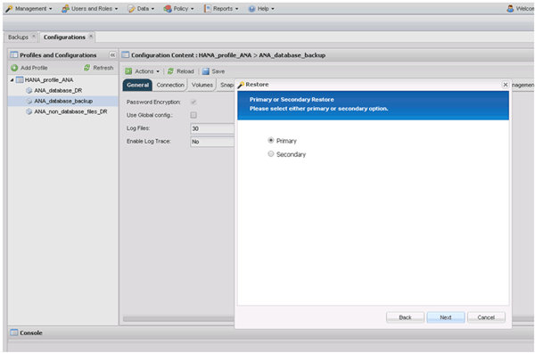
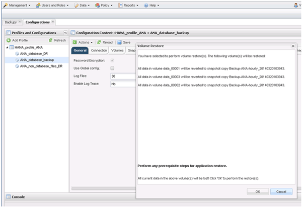
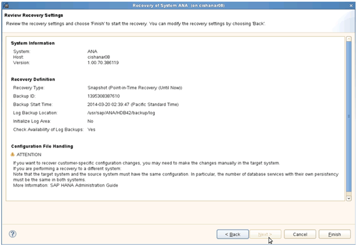

= Restauration et récupération des bases de données à partir du système de stockage primaire
:allow-uri-read: 
:icons: font
:imagesdir: ../media/

[role="lead"]
Vous pouvez restaurer et récupérer la base de données à partir du stockage primaire.

NOTE: Vous ne pouvez pas restaurer des copies de sauvegarde basées sur des fichiers à partir de Snap Creator.

. Dans SAP HANA Studio, sélectionnez *recover* pour le système SAP HANA.
+
image::../media/sap_hana_recover_primary_gui.gif[Cette image est expliquée par le texte qui l'entoure.]

+
Le système SAP HANA s'arrête.

. Sélectionnez le type de récupération et cliquez sur *Suivant*.
+
image::../media/sap_hana_specify_recovery_type_gui.gif[Cette image est expliquée par le texte qui l'entoure.]

. Indiquez les emplacements de sauvegarde du journal et cliquez sur *Suivant*.
+
image::../media/sap_hana_recover_primary_log_backup_location.gif[Cette image est expliquée par le texte qui l'entoure.]

+
La liste des sauvegardes disponibles s'appuie sur le contenu du catalogue de sauvegardes.

. Sélectionnez la sauvegarde requise et enregistrez l'ID de sauvegarde externe.
+
image::../media/sap_hana_recovery_primary_select_backup.gif[Cette image est expliquée par le texte qui l'entoure.]

. Désactivez la relation SnapVault.
+

NOTE: Cette étape n'est requise qu'avec clustered Data ONTAP.

+
Si vous avez besoin de restaurer une copie Snapshot antérieure à la copie Snapshot actuellement utilisée comme copie Snapshot de base pour SnapVault, vous devez d'abord désactiver la relation SnapVault dans clustered Data ONTAP. Pour ce faire, exécutez les commandes suivantes sur la console backup cluster :

+
[listing]
----
hana::> snapmirror quiesce -destination-path hana2b:backup_hana_data
Operation succeeded: snapmirror quiesce for destination hana2b:backup_hana_data.

hana::> snapmirror delete -destination-path hana2b:backup_hana_data
Operation succeeded: snapmirror delete the relationship with destination hana2b:backup_hana_data.

hana::> snapmirror release -destination-path hana2b:backup_hana_data
[Job 6551] Job succeeded: SnapMirror Release Succeeded
----
. Dans l'interface graphique Snap Creator, sélectionnez le système SAP HANA, puis sélectionnez *actions* > *Restore*.
+
image::../media/sap_hana_select_restore_backup.gif[Cette image est expliquée par le texte qui l'entoure.]

+
L'écran Bienvenue dans l'assistant de restauration Snap Creator Framework s'affiche.

. Cliquez sur *Suivant*.
+
image::../media/sap_hana_primary_restore_welcome_screen.gif[Cette image est expliquée par le texte qui l'entoure.]

. Sélectionnez *Primary* et cliquez sur *Next*.
+

. Sélectionnez Restore from primaire Storage.
. Sélectionnez le contrôleur de stockage, le nom du volume et le nom de la copie Snapshot.
+
Le nom du snapshot est en corrélation avec l'ID de sauvegarde sélectionné dans SAP HANA Studio.

+
image::../media/sap_hana_select_backup_restore_scf_gui.gif[Cette image est expliquée par le texte qui l'entoure.]

. Cliquez sur *Terminer*.
+
image::../media/sap_hana_primary_restore_summary.gif[Cette image est expliquée par le texte qui l'entoure.]

. Cliquez sur *Oui* pour ajouter d'autres éléments de restauration.
+
image::../media/sap_hana_add_more_restore_items.gif[Cette image est expliquée par le texte qui l'entoure.]

. Sélectionnez le contrôleur de stockage, le nom du volume supplémentaire et le nom de la copie Snapshot.
+
Le nom du snapshot est en corrélation avec l'ID de sauvegarde sélectionné dans SAP HANA Studio.

+
image::../media/sap_hana_primary_select_restore_details.gif[Cette image est expliquée par le texte qui l'entoure.]

. Répétez les étapes 10 à 13 jusqu'à ce que tous les volumes requis soient ajoutés ; dans notre exemple, Data_00001, Data_00002 et Data_00003 doivent être sélectionnés pour le processus de restauration.
. Lorsque tous les volumes sont sélectionnés, cliquez sur *OK* pour lancer le processus de restauration.
+

+
Le processus de restauration démarre.

+
image::../media/sap_hana_primary_general_restore_process_in_progress.gif[Cette image est expliquée par le texte qui l'entoure.]

+
Attendez que le processus de restauration soit terminé.

. Sur chaque nœud de base de données, remontez tous les volumes de données sur les pointeurs NFS obsolètes.
+
Dans l'exemple, les trois volumes doivent être remontés sur chaque nœud de base de données.

+
[listing]
----
mount -o remount /hana/data/ANA/mnt00001
mount -o remount /hana/data/ANA/mnt00002
mount -o remount /hana/data/ANA/mnt00003
----
. Accédez à SAP HANA Studio et cliquez sur *Refresh* pour mettre à jour la liste des sauvegardes disponibles.
+
image::../media/sap_hana_primary_select_backup.gif[Cette image est expliquée par le texte qui l'entoure.]

+
La sauvegarde restaurée avec Snap Creator est indiquée par une icône verte dans la liste des sauvegardes.

. Sélectionnez la sauvegarde et cliquez sur *Suivant*.
+
image::../media/sap_hana_select_backup_to_recover_database.gif[Cette image est expliquée par le texte qui l'entoure.]

. Sélectionnez d'autres paramètres comme requis et cliquez sur *Suivant*.
+
image::../media/sap_hana_select_backup_other_settings.gif[Cette image est expliquée par le texte qui l'entoure.]

. Cliquez sur *Terminer*.
+

+
Le processus de récupération commence.

+
image::../media/sap_hana_primary_recovery_progress_information.gif[Cette image est expliquée par le texte qui l'entoure.]

. Une fois la restauration terminée, reprendre les relations SnapVault, si nécessaire.
+
image::../media/sap_hana_primary_recovery_execution_summary.gif[Cette image est expliquée par le texte qui l'entoure.]

