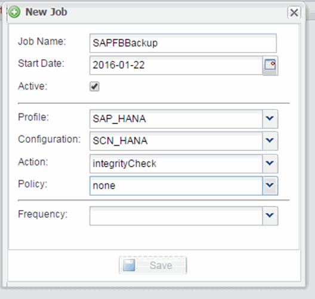

= Planification des contrôles d'intégrité de la base de données
:allow-uri-read: 
:icons: font
:imagesdir: ../media/

[role="lead"]
Pour les configurations SAP HANA, vous pouvez planifier des opérations supplémentaires, telles que la sauvegarde basée sur des fichiers et les vérifications de l'intégrité des bases de données. Vous pouvez programmer l'opération de vérification de l'intégrité de la base de données pour qu'elle se produise à des intervalles spécifiques.

. Dans le menu principal de l'interface graphique Snap Creator, sélectionnez *Management* > *Schedules*, puis cliquez sur *Create*.
. Dans la fenêtre Nouveau travail, entrez les détails du travail.
+
La règle de contrôle d'intégrité est définie sur « aucune » par défaut.

+

